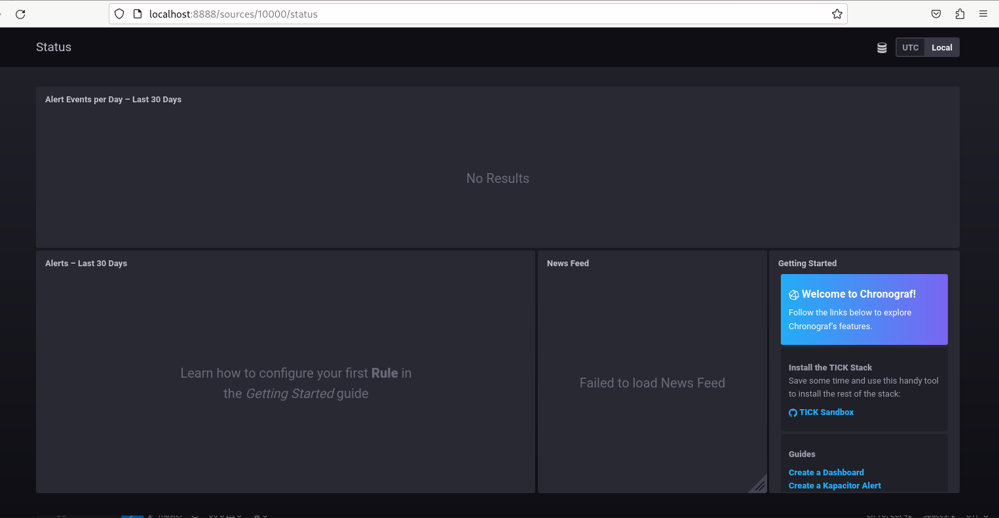
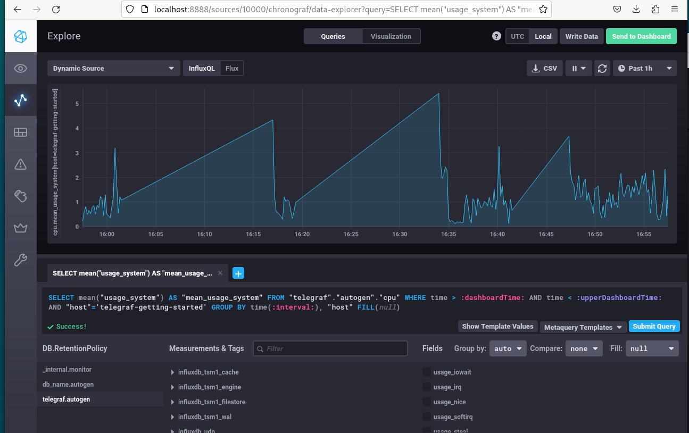
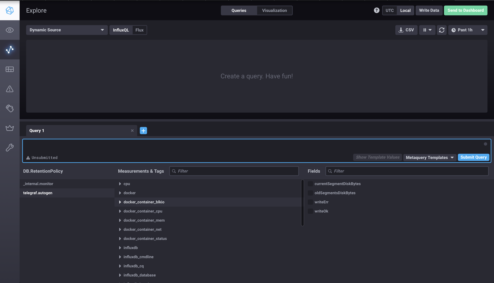

# Домашнее задание к занятию "13.Системы мониторинга" Барсуков Алексей

## Обязательные задания

1. Вас пригласили настроить мониторинг на проект. На онбординге вам рассказали, что проект представляет из себя 
платформу для вычислений с выдачей текстовых отчетов, которые сохраняются на диск. Взаимодействие с платформой 
осуществляется по протоколу http. Также вам отметили, что вычисления загружают ЦПУ. Какой минимальный набор метрик вы
выведите в мониторинг и почему?

ОТВЕТ:

- CPU LA, т.к было отмечено, что вычесления загружают ЦПУ.
- RAM/Swap, вычисления могут потреблять значительные объемы памяти, что способно привести к сбоям из-за нехватки ресурсов.
- IOPS, т.к отчеты сохраняются на диск необходимо мониторить производительность дисковой подсистемы.
- FS, т.к отчеты сохраняются на диск, необходимо отслеживать свободное место на диске.
- inodes, данную метрику необходимо отслеживать из-за того, что если индексные дескрипторов будут переполнены, то дальнейшая запись отчетов может быть не возможна
- IOwait, количество I/O-запросов в очереди, если показатели будут высокими, то запись отчетов на дисковую подсистему будет проходить слишком медленно.
- NetTraffic т.к платформа взаимодействует по HTTP. Задержки или ошибки сети могут повлиять на доступность.
- HTTP запрсы, т.к это основной способ взаимодействия сплатформой, необходимо отслеживать коллисчетсво запросов HTTP, распределение статусов ответов.

#
2. Менеджер продукта посмотрев на ваши метрики сказал, что ему непонятно что такое RAM/inodes/CPUla. Также он сказал, 
что хочет понимать, насколько мы выполняем свои обязанности перед клиентами и какое качество обслуживания. Что вы 
можете ему предложить?

Ответ

Предложу заключить SLA c клиентом,внутри опираться на SLO и SLI.

#
3. Вашей DevOps команде в этом году не выделили финансирование на построение системы сбора логов. Разработчики в свою 
очередь хотят видеть все ошибки, которые выдают их приложения. Какое решение вы можете предпринять в этой ситуации, 
чтобы разработчики получали ошибки приложения?

Ответ:
- Быстрое решение на ближайшие пару недель: Реализовать bash-скрипт с webhook для отправки ошибок в Slack/Telegram. Это даст разработчикам мгновенную обратную связь и займет минимум времени.
- Среднесрочное и самое эффективное решение: Интегрировать Sentry по бесплатному плану. Это даст разработчикам максимальное качество информации об ошибках с минимальными затратами на внедрение и поддержку.
- Как только финансирование появится: Перейти на платный план Sentry или развернуть собственный стек (Loki, Elasticsearch) для полного сбора всех логов, а не только ошибок.

#
4. Вы, как опытный SRE, сделали мониторинг, куда вывели отображения выполнения SLA=99% по http кодам ответов. 
Вычисляете этот параметр по следующей формуле: summ_2xx_requests/summ_all_requests. Данный параметр не поднимается выше 
70%, но при этом в вашей системе нет кодов ответа 5xx и 4xx. Где у вас ошибка?

Ответ:

Формула не правильная, так как коректный ответы http сервера может быть не только 200-ые, но и 300-ые и 100-ые.


Правильная формула:

```
SLA = (1 - (summ_5xx_requests + summ_4xx_requests_which_are_our_fault) / summ_all_requests) * 100%
```

#
5. Опишите основные плюсы и минусы pull и push систем мониторинга.

### Push-модель (Толкающая)

**Как работает:** Агенты на monitored-хостах самостоятельно инициируют соединение и отправляют (push) метрики на центральный сервер сбора.

**Аналогия:** Почтовое отделение (агент) само привозит посылки (метрики) на сортировочный центр (сервер).

#### Плюсы (+)

1.  **Гибкость и мобильность:** Легко отправить метрики с любого устройства, из любой сети, главное — чтобы был доступ до сервера приёмника. Идеально для:
    *   Клиентских устройств (браузеры, мобильные приложения).
    *   Кратковременных задач (AWS Lambda, batch-задачи), которые живут недолго и не могут ждать, пока их "спросят".
    *   Ситуаций с динамической инфраструктурой (автоскейлинг), где набор целей для опроса постоянно меняется.

2.  **Мгновенность:** Метрики отправляются сразу после их сбора или по истечении интервала. Сервер всегда получает данные с минимальной задержкой.

3.  **Контроль нагрузки на клиенте:** Клиент сам решает, когда и сколько данных отправлять. Это может помочь сгладить пики потребления ресурсов на стороне агента.

4.  **Проще в настройке сети (с точки зрения клиента):** Достаточно разрешить только **исходящий трафик** с клиентских машин на один порт сервера. Не нужно давать серверу доступ до всей инфраструктуры.

#### Минусы (-)

1.  **Риск потери данных (Blackholes):** Если сервер сбора перезагрузился или временно недоступен, метрики, отправленные в этот период, **теряются безвозвратно**. Клиент не хранит их.

2.  **Сложность контроля доступа:** Любой, кто знает адрес сервера, может отправить на него метрики. Требуются дополнительные механизмы аутентификации и авторизации (токены, сертификаты), чтобы избежать попадания ложных данных.

3.  **Проблема "тихого" отказа (Silent Failures):** Если агент перестал отправлять метрики, сложно понять почему: то ли он "умер", то ли сломался скрипт, то ли проблемы с сетью. Нет простого способа отличить простое бездействие от сбоя.

4.  **Сложность обнаружения целей:** Серверу нужно заранее знать, от кого он *может* получать данные, или иметь механизм динамической регистрации. Или же клиенты должны сами регистрироваться.

---

### Pull-модель (Тянущая)

**Как работает:** Центральный сервер периодически опрашивает (pull) все известные ему цели (targets), запрашивая у них метрики.

**Аналогия:** Сортировочный центр (сервер) сам отправляет курьеров (запросы) по известным адресам (targets) для забора посылок (метрик).

#### Плюсы (+)

1.  **Высокая надёжность и гарантия доставки:** Сервер сам управляет процессом сбора. Если цель не ответила, он узнает об этом немедленно и может повторить попытку или зафиксировать факт недоступности цели как метрику (`up{job="..."} = 0`). **Данные не теряются** из-за кратковременной недоступности сервера — он просто запросит их снова позже.

2.  **Конфигурация и контроль на стороне сервера:** Легко centrally управлять тем, что и как часто мы собираем. Легко добавить или убрать цель для мониторинга, не внося изменения на самих хостах.

3.  **Безопасность и контроль доступа:** Сервер инициирует соединения только с доверенными целями из своего white-list. Посторонние не могут просто так отправить данные. Это упрощает аутентификацию (часто достаточно TLS).

4.  **Идеально для статической инфраструктуры:** Отлично работает в предсказуемом окружении, где набор серверов известен и меняется нечасто.

#### Минусы (-)

1.  **Сложность в динамических средах:** Для мониторинга кратковременных задач (например, контейнеров в Kubernetes) нужно использовать механизмы服务发现 (service discovery), чтобы автоматически находить и добавлять новые цели для опроса.

2.  **Требует большего доступа в сети:** Сервер должен иметь **сетевой доступ до ВСЕХ monitored-хостов**. Это создает более сложную модель безопасности (DMZ, брандмауэры) по сравнению с Push.

3.  **Риск недосмотреть:** Если сервер не знает о существовании какого-то хоста, он никогда его не опросит. Такие хосты могут оставаться "в тени".

4.  **Задержка данных (Latency):** Данные обновляются только с интервалом опроса (scrape_interval). Между опросами актуальные данные находятся только на самом целевом хосте.

---

#
6. Какие из ниже перечисленных систем относятся к push модели, а какие к pull? А может есть гибридные?

    - Prometheus 
    - TICK
    - Zabbix
    - VictoriaMetrics
    - Nagios

### Ответ

Pull модель: Nagios, Prometheus
Push модель: TICK
Pull и Push модель: Zabbix, VictoriaMetrics

#
7. Склонируйте себе [репозиторий](https://github.com/influxdata/sandbox/tree/master) и запустите TICK-стэк, 
используя технологии docker и docker-compose.

В виде решения на это упражнение приведите скриншот веб-интерфейса ПО chronograf (`http://localhost:8888`). 

P.S.: если при запуске некоторые контейнеры будут падать с ошибкой - проставьте им режим `Z`, например
`./data:/var/lib:Z`




#
8. Перейдите в веб-интерфейс Chronograf (http://localhost:8888) и откройте вкладку Data explorer.
        
    - Нажмите на кнопку Add a query
    - Изучите вывод интерфейса и выберите БД telegraf.autogen
    - В `measurments` выберите cpu->host->telegraf-getting-started, а в `fields` выберите usage_system. Внизу появится график утилизации cpu.
    - Вверху вы можете увидеть запрос, аналогичный SQL-синтаксису. Поэкспериментируйте с запросом, попробуйте изменить группировку и интервал наблюдений.

Для выполнения задания приведите скриншот с отображением метрик утилизации cpu из веб-интерфейса.


#
9. Изучите список [telegraf inputs](https://github.com/influxdata/telegraf/tree/master/plugins/inputs). 
Добавьте в конфигурацию telegraf следующий плагин - [docker](https://github.com/influxdata/telegraf/tree/master/plugins/inputs/docker):
```
[[inputs.docker]]
  endpoint = "unix:///var/run/docker.sock"
```

Дополнительно вам может потребоваться донастройка контейнера telegraf в `docker-compose.yml` дополнительного volume и 
режима privileged:
```
  telegraf:
    image: telegraf:1.4.0
    privileged: true
    volumes:
      - ./etc/telegraf.conf:/etc/telegraf/telegraf.conf:Z
      - /var/run/docker.sock:/var/run/docker.sock:Z
    links:
      - influxdb
    ports:
      - "8092:8092/udp"
      - "8094:8094"
      - "8125:8125/udp"
```

После настройке перезапустите telegraf, обновите веб интерфейс и приведите скриншотом список `measurments` в 
веб-интерфейсе базы telegraf.autogen . Там должны появиться метрики, связанные с docker.




Факультативно можете изучить какие метрики собирает telegraf после выполнения данного задания.


---

